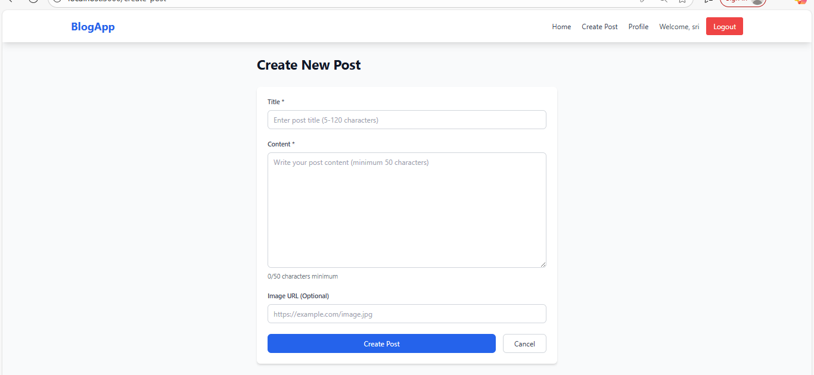

# Blog Application

A full-stack blog application built with Node.js, MongoDB, React, and Tailwind CSS. Features user authentication, CRUD operations for posts, pagination, search functionality, and a modern responsive UI.

## 🚀 Features

### Authentication
- User registration and login with JWT
- Password hashing with bcrypt
- Protected routes and middleware
- Session management

### Posts Management
- Create, read, update, and delete posts
- Rich text content with optional images
- Search posts by title or username
- Pagination for better performance
- Owner-only edit/delete permissions

### User Interface
- Modern, responsive design with Tailwind CSS
- Mobile-friendly navigation
- Real-time form validation
- Loading states and error handling
- Clean, intuitive user experience

## 🛠️ Tech Stack

### Backend
- **Node.js** - Runtime environment
- **Express.js** - Web framework
- **MongoDB** - Database
- **Mongoose** - ODM for MongoDB
- **JWT** - Authentication tokens
- **bcryptjs** - Password hashing
- **express-validator** - Input validation
- **CORS** - Cross-origin resource sharing

### Frontend
- **React 18** - UI library
- **React Router** - Client-side routing
- **Tailwind CSS** - Utility-first CSS framework
- **Axios** - HTTP client
- **React Context** - State management

## 📁 Project Structure

```
Blogpage/
├── server/                 # Backend application
│   ├── models/            # MongoDB models
│   │   ├── User.js
│   │   └── Post.js
│   ├── routes/            # API routes
│   │   ├── auth.js
│   │   └── posts.js
│   ├── middleware/         # Custom middleware
│   │   └── auth.js
│   ├── utils/             # Utility functions
│   │   └── jwt.js
│   ├── scripts/           # Database scripts
│   │   └── seed.js
│   ├── server.js          # Main server file
│   ├── package.json
│   └── env.example
├── client/                # Frontend application
│   ├── public/
│   │   └── index.html
│   ├── src/
│   │   ├── components/    # Reusable components
│   │   │   ├── Navbar.js
│   │   │   └── ProtectedRoute.js
│   │   ├── pages/         # Page components
│   │   │   ├── Home.js
│   │   │   ├── PostDetail.js
│   │   │   ├── CreatePost.js
│   │   │   ├── EditPost.js
│   │   │   ├── Login.js
│   │   │   ├── Register.js
│   │   │   └── Profile.js
│   │   ├── context/       # React Context
│   │   │   └── AuthContext.js
│   │   ├── utils/         # Utility functions
│   │   │   └── api.js
│   │   ├── App.js
│   │   ├── index.js
│   │   └── index.css
│   ├── package.json
│   ├── tailwind.config.js
│   ├── postcss.config.js
│   └── env.example
└── README.md
```

## 🚀 Getting Started

### Prerequisites

- Node.js (v14 or higher)
- MongoDB (local installation or MongoDB Atlas)
- npm or yarn

### Installation

1. **Clone the repository**
   ```bash
   git clone <repository-url>
   cd Blogpage
   ```

2. **Install server dependencies**
   ```bash
   cd server
   npm install
   ```

3. **Install client dependencies**
   ```bash
   cd ../client
   npm install
   ```

4. **Set up environment variables**

   **Server (.env)**
   ```bash
   cd ../server
   cp env.example .env
   ```
   
   Edit `.env` file:
   ```
   PORT=5000
   MONGODB_URI=mongodb://localhost:27017/blogapp
   JWT_SECRET=your_super_secret_jwt_key_here
   JWT_EXPIRE=7d
   NODE_ENV=development
   ```

   **Client (.env)**
   ```bash
   cd ../client
   cp env.example .env
   ```
   
   Edit `.env` file:
   ```
   REACT_APP_API_URL=http://localhost:5000/api
   ```

5. **Start MongoDB**
   - If using local MongoDB: `mongod`
   - If using MongoDB Atlas: Update the connection string in `.env`

6. **Seed the database (optional)**
   ```bash
   cd server
   npm run seed
   ```

### Running the Application

1. **Start the backend server**
   ```bash
   cd server
   npm run dev
   ```
   Server will run on `http://localhost:5000`

2. **Start the frontend client**
   ```bash
   cd client
   npm start
   ```
   Client will run on `http://localhost:3000`

3. **Access the application**
   Open your browser and navigate to `http://localhost:3000`

## 📚 API Documentation

### Authentication Endpoints

#### Register User
```http
POST /api/auth/register
Content-Type: application/json

{
  "username": "johndoe",
  "email": "john@example.com",
  "password": "password123"
}
```

#### Login User
```http
POST /api/auth/login
Content-Type: application/json

{
  "email": "john@example.com",
  "password": "password123"
}
```

### Posts Endpoints

#### Get All Posts (with pagination and search)
```http
GET /api/posts?page=1&limit=10&search=react
```

#### Get Single Post
```http
GET /api/posts/:id
```

#### Create Post (Protected)
```http
POST /api/posts
Authorization: Bearer <token>
Content-Type: application/json

{
  "title": "My Blog Post",
  "content": "This is the content of my blog post...",
  "imageURL": "https://example.com/image.jpg"
}
```



#### Update Post (Protected - Owner only)
```http
PUT /api/posts/:id
Authorization: Bearer <token>
Content-Type: application/json

{
  "title": "Updated Title",
  "content": "Updated content..."
}
```


#### Delete Post (Protected - Owner only)
```http
DELETE /api/posts/:id
Authorization: Bearer <token>
```

### Response Formats

#### Success Response
```json
{
  "message": "Operation successful",
  "data": { ... }
}
```

#### Error Response
```json
{
  "message": "Error description",
  "errors": [
    {
      "param": "fieldName",
      "msg": "Error message"
    }
  ]
}
```

## 🎯 Usage

### For Users

1. **Register/Login**: Create an account or login to access all features
2. **Browse Posts**: View all posts on the home page with search and pagination
3. **Read Posts**: Click on any post to view full content
4. **Create Posts**: Write and publish your own blog posts
5. **Manage Posts**: Edit or delete your posts from the profile page

### For Developers

- **Authentication**: JWT tokens are automatically handled
- **Validation**: Both client and server-side validation
- **Error Handling**: Comprehensive error handling throughout the app
- **Responsive Design**: Mobile-first approach with Tailwind CSS

## 🔧 Development

### Available Scripts

**Server:**
- `npm start` - Start production server
- `npm run dev` - Start development server with nodemon
- `npm run seed` - Seed database with sample data

**Client:**
- `npm start` - Start development server
- `npm run build` - Build for production
- `npm test` - Run tests

### Code Structure

- **Models**: MongoDB schemas with validation
- **Routes**: RESTful API endpoints
- **Middleware**: Authentication and error handling
- **Components**: Reusable React components
- **Pages**: Main application pages
- **Context**: Global state management
- **Utils**: Helper functions and API client

## 🚀 Deployment

### Backend Deployment

1. Set up a MongoDB database (MongoDB Atlas recommended)
2. Configure environment variables for production
3. Deploy to platforms like Heroku, Vercel, or AWS

### Frontend Deployment

1. Build the React app: `npm run build`
2. Deploy the `build` folder to platforms like Netlify, Vercel, or AWS S3

### Environment Variables for Production

**Server:**
```
NODE_ENV=production
MONGODB_URI=your_production_mongodb_uri
JWT_SECRET=your_production_jwt_secret
PORT=5000
```

**Client:**
```
REACT_APP_API_URL=your_production_api_url
```

## 🤝 Contributing

1. Fork the repository
2. Create a feature branch: `git checkout -b feature-name`
3. Commit changes: `git commit -am 'Add feature'`
4. Push to branch: `git push origin feature-name`
5. Submit a pull request

## 📝 License

This project is licensed under the MIT License.

## 🐛 Troubleshooting

### Common Issues

1. **MongoDB Connection Error**
   - Ensure MongoDB is running
   - Check connection string in `.env`

2. **CORS Errors**
   - Verify API URL in client `.env`
   - Check server CORS configuration

3. **Authentication Issues**
   - Clear browser localStorage
   - Check JWT secret configuration

4. **Build Errors**
   - Clear node_modules and reinstall
   - Check Node.js version compatibility


